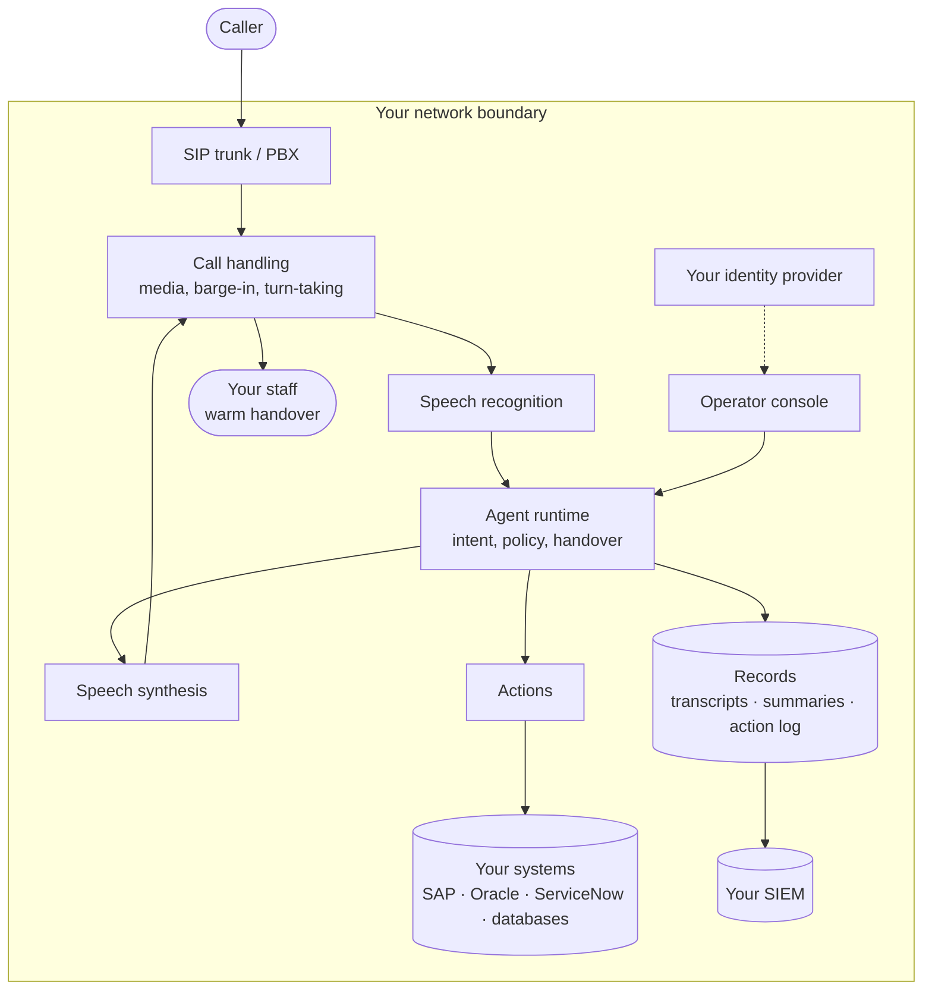

An on-premise deployment puts the whole call path inside one trust boundary you define. Callers reach it over the telephony you already have; the agent reaches your systems over your own network; nothing in the loop requires a hop to the public internet.

## The boundary

Everything in the box runs on your hardware. The caller's audio enters through your trunk and never crosses the boundary.

## Components

<AccordionGroup>
  <Accordion title="Call handling" icon="phone">
    Owns the media path: accepting the call, streaming audio in both directions, detecting when the caller interrupts, and deciding when a turn has ended. This is the component with the tightest latency budget, and the one that sits closest to your telephony.
  </Accordion>

  <Accordion title="Speech recognition" icon="ear-listen">
    Converts caller audio to text, including Najdi and other Gulf dialects and sentences that switch between Arabic and English mid-way. Runs on GPU-accelerated hosts inside your boundary.
  </Accordion>

  <Accordion title="Agent runtime" icon="headset">
    Works out what the caller wants, follows the instructions you configured, decides when an action should fire, and applies your handover rules. Handover is a rule you set, not a judgement the agent makes on its own — see [Handover](/handoff).
  </Accordion>

  <Accordion title="Speech synthesis" icon="waveform-lines">
    Produces the agent's audio, streaming the first words while the rest of the sentence is still being written. Emits telephony-native 8 kHz mulaw so there is no transcoding step between Voho and your trunk. See [Voices](/voices).
  </Accordion>

  <Accordion title="Actions" icon="bolt">
    The outbound integration layer. Each action calls one of your systems over its own API, authenticated as a service account whose permissions you control. Actions that your policy says need sign-off stop and ask. See [Actions](/actions).
  </Accordion>

  <Accordion title="Records" icon="file-lines">
    Turn-by-turn transcript, bilingual summary, and every action taken with its result — written to storage you own, under your retention policy. See [Transcripts and records](/transcripts).
  </Accordion>
</AccordionGroup>

## Telephony

Voho meets the phone system you already run. Audio is available as 8 kHz mulaw, which is what SIP trunks, Cisco and Avaya estates already carry, so there is no transcoding hop and no new numbers to provision.

<Tip>
  Keep the call-handling component and your SIP termination close to each other on the network. Round trips between them land directly in the silence the caller hears — the metric that matters is time to first audio. See [Latency](/latency).
</Tip>

## Identity and access

Operators sign in with your existing corporate identity — SAML or OIDC single sign-on, with SCIM for provisioning and de-provisioning. Roles are yours to define: reviewing calls for quality is a legitimate reason to read transcripts, and company-wide availability is not.

{/* TODO: confirm exactly which SSO protocols and SCIM version the on-prem build supports, and whether local accounts are available as a break-glass path. */}

## Observability

A local dashboard, served from the deployment itself, shows usage and system health without anything leaving your network to render it.

Alongside it, configuration changes, access events and exports are recorded and can be streamed to your own SIEM, so the audit trail lives in the system your auditors already read rather than in a vendor console.

{/* TODO: confirm what the local dashboard actually exposes, whether it authenticates against the customer IdP, and the audit export format and transport (syslog? webhook? file drop?) before naming any of them here. */}

## Licensing and egress

This is the first thing a security review tests, so it is worth stating precisely.

**Licensing does not require a live connection.** The deployment checks a signed licence file held locally. It keeps running whether or not it can reach anything outside your network, and if a licence is not renewed in time it degrades gracefully rather than cutting the line off mid-call.

{/* TODO: define "degrades gracefully" concretely — what capability is reduced, at what point, and what the operator sees. A security review will ask, and "gracefully" is not an answer. */}

**Usage metering is reported back periodically for billing.** This is the one outbound flow in a standard deployment. Your records — audio, transcripts, summaries and the action log — are written to your storage and are not what this flow is for. Ask for the exact contents in writing during scoping, the same way you would of any vendor.

{/* TODO: confirm the exact contents of the usage report (call counts? durations? anything else?), destination hosts and ports, and frequency — then state it here affirmatively and drop the "ask in scoping" hedge. Deliberately not asserting "no call content leaves" until engineering confirms it, because that sentence gets quoted in security reviews. */}

<Warning>
  If your requirement is a genuinely air-gapped deployment with zero egress, raise it explicitly in scoping. Licensing works offline, but the billing usage sync needs an agreed answer — an offline submission path, or a contractual arrangement that removes it.
  {/* TODO: confirm whether an offline usage submission exists. The public site currently claims fully disconnected operation with nothing leaving; until this is answered, that claim and this stack are not obviously consistent. Flagged to Yar 2026-08-22. */}
</Warning>

## Next

<CardGroup cols={2}>
  <Card title="Requirements" icon="list-check" href="/on-prem/requirements">
    Hardware, software and network prerequisites.
  </Card>
  <Card title="Operations" icon="gauge-high" href="/on-prem/operations">
    Running it after go-live.
  </Card>
</CardGroup>
